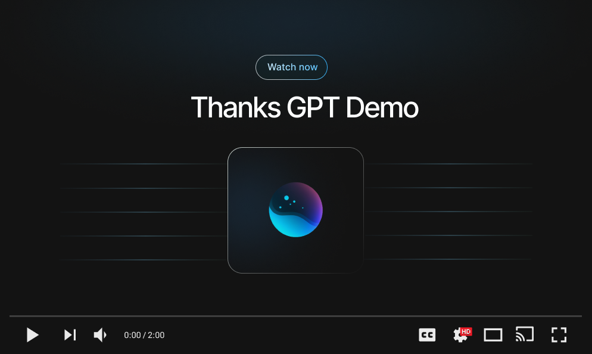

<a name="readme-top"></a>

<br />
<div align="center">
  <a href="https://github.com/ntegrals/thanksgpt">
    
  </a>

<h3 align="center">Thanks GPT</h3>

  <p align="center">
    Self-repairing code for any language, programming language translation, automatic unit tests, and much more
    <br />
    <br />
    <a href="https://github.com/ntegrals/thanksgpt">View Demo</a>
    ·
    <a href="https://github.com/ntegrals/thanksgpt/issues">Report Bug</a>
    ·
    <a href="https://github.com/ntegrals/thanksgpt/issues">Request Feature</a>
  </p>
</div>

<a href="https://www.loom.com/share/9b390a7a4bd24f399637a68036f22648">
    
  </a>

## Features

    ✅ Self-Repairing Code              [Runs a script in any language and fixes it upon crash]
    ✅ Generate Unit Tests              [Generates unit tests for a code file]
    ✅ Conduct Code Reviews             [Reviews a code file]
    ✅ Translate Programming Languages  [Converts a code file to another language]
    ✅ ELI5 Code                        [Generates an ELI5 explanation]
    ✅ Refactor Code                    [Refactors the code]
    ✅ Document Code                    [Adds documentation to the code]
    ✅ Best Practices                   [Converts the code to use the best practices]
    ✅ Arbitrary Input                  [Prompt GPT-4 anything]
    🟨 Reflexion                        [GPT reflects on it's answers to improve the output quality]
    🟨 Add new feature                  [Adds a new feature based on an input file]
    🟨 Increase context window          [Increase context window with vector embeddings]
    🟨 Process directories              [CLI can process directories and not only files]

## Installation

You need to have [Node.js](https://nodejs.org/en) installed.

1. Get an OpenAI API Key at [https://openai.com/](https://openai.com/)

   ❗️ By default the model uses GPT-4. If you don't have access to GPT-4 yet, you have to use the --gpt3 flag. (It will then use the GPT-3.5 Turbo model)

2. Install the CLI via npm
   ```sh
   npm install -g thanksgpt
   ```
3. The CLI can then simply be called by running:
   ```
   thanksgpt
   ```
   or
   ```
   thanks
   ```
   I'm going to use the latter in the following examples for the sake of brevity.
4. Add your OpenAI API key (It's only stored on your device)
   ```sh
   thanks -ak "sk-9jfoa..."
   ```

<!-- USAGE EXAMPLES -->

## Examples

### 1. Self-Repair a Python file

Run the thanks command in a directory with a file called `test.py`:

```sh
  thanks -f test.py python3
```

This command will run the file `test.py` with the interpreter `python3` and automatically try to fix it when it crashes or has a bug.

### 2. Translate from Python to TypeScript

Run the thanks command in a directory with a file called `test.py`. We also need to specify a file that we want to write to `test.ts` in this case (If not the CLI will only log to the console). Now Thanks GPT will automatically translate the code to TypeScript.

```sh
  thanks -l test.py TypeScript -o test.ts
```

### 3. Conduct a code review

Run the thanks command in a directory with a file called `test.py`. In this case we might only want to view the output in the terminal, so we don't need to specify an output file. This command will review the code and give you feedback on how to improve it.

```sh
  thanks -r test.py
```

### 4. Generate unit tests

Run the thanks command in a directory with a file called `hello.ts` with the testing framework that we want to use (Jest in this case). We also need to specify the file that we want to write to `hello.test.ts`. Now Thanks GPT will automatically generate unit tests for the code.

```sh
  thanks -t hello.ts Jest -o hello.test.ts
```

## Usage

<!--  -->

<!-- Use this space to show useful examples of how a project can be used. Additional screenshots, code examples and demos work well in this space. You may also link to more resources. -->

Run `thanks -h` to see all available commands

    Options:
    -v, --version                             output the current version
    -r, --review  <filePath>                  code review for a file
    -i, --improve  <filePath>                 refactor the code
    -b, --best  <filePath>                    convert the code to the best practices
    -f, --fix [filePath interpreter...]       fix the code recursively
    -l, --lang [filePath targetLanguage...]   convert the code to a different language
    -e, --eli5 <filePath>                     explain the code in simple terms
    -t, --test [filePath framework...]        generate unit tests for the code
    -d, --document <filePath>                 generate documentation for the code
    -x, --arbitraryFile [filePath prompt...]  accepts any instruction (prompt needs to be in quotes)
    -z, --arbitrary <prompt>                  accepts any instruction
    -o, --output [filePath]                   the output file path
    -s, --silent                              prevents logging the stream to the console
    -g3, --gpt3                               only uses GPT-3.5
    -ak, --addkey [apiKey]                    add your OpenAI API key to the the environment
    -dk, --deletekey                          delete your OpenAI API key from the environment
    -pk, --printkey                           print your OpenAI API key
    -h, --help                                display help for command

## Contact

Hi! Thanks for checking out and using this library. If you are interested in discussing your project, require mentorship, consider hiring me, or just wanna chat - I'm happy to talk.

You can send me an email to get in touch: j.schoen@mail.com or message me on Twitter: [@julianschoen](https://twitter.com/julianschoen)

If you'd just want to give something back, I've got a Buy Me A Coffee account:

<a href="https://www.buymeacoffee.com/ntegrals">

</a>

Thanks and have an awesome day 👋

## Disclaimer

Thanks GPT, is an experimental application and is provided "as-is" without any warranty, express or implied. By using this software, you agree to assume all risks associated with its use, including but not limited to data loss, system failure, or any other issues that may arise.

The developers and contributors of this project do not accept any responsibility or liability for any losses, damages, or other consequences that may occur as a result of using this software. You are solely responsible for any decisions and actions taken based on the information provided by Thanks GPT.

Please note that the use of the GPT-4 language model can be expensive due to its token usage. By utilizing this project, you acknowledge that you are responsible for monitoring and managing your own token usage and the associated costs. It is highly recommended to check your OpenAI API usage regularly and set up any necessary limits or alerts to prevent unexpected charges.

By using Thanks GPT, you agree to indemnify, defend, and hold harmless the developers, contributors, and any affiliated parties from and against any and all claims, damages, losses, liabilities, costs, and expenses (including reasonable attorneys' fees) arising from your use of this software or your violation of these terms.

<!-- LICENSE -->

## License

Distributed under the MIT License. See `LICENSE` for more information.

[product-screenshot]: images/demo.png
